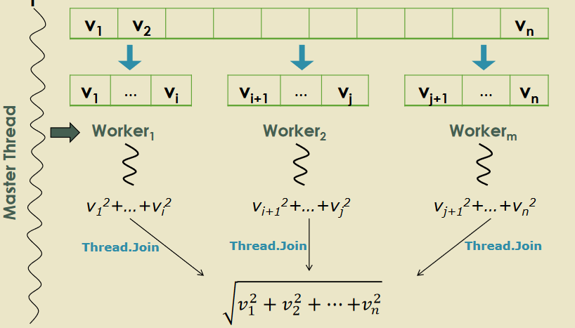

# Tema 4 - Programación concurrente y paralela
## Ley de Moore
Es una ley empírica que dice: *El número de transistores por unidad de superficie en circuitos integrados se duplica cada 24 meses, sin encarecer su precio*

## Arquitecturas
En las #arquitecturas actuales solemos disponer de multinúcleos, siendo estos núcleos los que se amplian en lugar de la frecuencia de reloj. Ofrecen computación paralela no sólo a nivel de proceso, sino también a nivel de hilo. Estas arquitecturas poseen una memoria compartida, para la cual cada procesador contará con una privada.

## Programación concurrente
El paralelismo es un caso particular de la concurrencia, en que las tareas se ejecutan de forma paralela (simultaneamente, **no simulada**).

El paralelismo enfatiza la división de un problema en partes más pequeñas.
La concurriencia enfatiza la interacción entre tareas.

Un proceso es un programa en ejecución que consta de instrucciones, estado de ejecución y valores de datos en ejecución.

Un hilo es una parte de un proceso, pudiendo denominarlo como una tarea de un proceso que puede ejecutarse concurrentemente, compartiendo la memoria del proceso, con el resto de sus hilos. Cada hilo deberá de tener un contador de programa, pila de ejecución y el valor de los registros.

## Paralelización de Algoritmos
Existen dos escenarios típicos de paralelización:
* Paralelización de tareas: Tareas independientes pueden ser ejecutadas concurrentemente (generar hashes ficheros, encriptar cadenas, generar thumbnails ficheros).
* Paralelización de datos: Ejecutar una misma tarea que computa porciones de los mismos datos (un texto de un libro para encontrar palabras).

Existe un modelo híbrido de los dos anteriores denominado pipeline. Sincronizamos la salida de una tarea como la entrada de la siguiente (terminal de linux con *ls | grep*).

## Creación explícita de hilos
Podemos hacer uso de la clase Thread (System.Threading) para encapsular un hilo de ejecución de forma explícita. Veamos un ejemplo:
```csharp
Thread hilo = new Thead(delegado);
hilo.Name = "Hilo secundario";
Treah.CurrentThread.Name = "Hilo principal";
hilo.Priority = ThreadPriority.BelowNormal;
hilo.Start(); // Se lanza el hilo secundario
```

Ahora vamos a paralelizar un problema por datos: calcular el módulo de un vector de n dimensiones. Para resolver este problema vamos a usar la técnica de master/worker, por lo tanto necesitamos crear esas clases.

<details><summary>Clase Master.cs</summary>

```csharp
public class Master {
        private short[] vector;
        private int numberOfThreads;

        public Master(short[] vector, int numberOfThreads) {
            if (numberOfThreads < 1 || numberOfThreads > vector.Length)
                throw new ArgumentException("The number of threads must be lower or equal to the elements of the vector");
            this.vector = vector;
            this.numberOfThreads = numberOfThreads;
        }
        
        public double ComputeModulus() {
            // * Workers are created
            Worker[] workers = new Worker[this.numberOfThreads];
            int elementsPerThread = this.vector.Length/numberOfThreads;
            for(int i=0; i < this.numberOfThreads; i++) {
                workers[i] = new Worker(this.vector,  i*elementsPerThread,(i<this.numberOfThreads-1) ? (i+1)*elementsPerThread-1: this.vector.Length-1);
			}
            Thread[] threads = new Thread[workers.Length];
            for(int i=0;i<workers.Length;i++) {
                threads[i] = new Thread(workers[i].Compute); // we create the threads
                threads[i].Name = "Vector modulus worker " + (i+1); // we name then (optional)
                threads[i].Priority = ThreadPriority.Normal; // we assign them a priority (optional)
                threads[i].Start();   // we start their execution
            }
            foreach (Thread thread in threads)
                thread.Join();
            long result = 0;
            foreach (Worker worker in workers)
                result += worker.Result;
            return Math.Sqrt(result);
        }
    }
```

</details>

<details><summary>Clase Worker.cs</summary>

```csharp
internal class Worker {
        private short[] vector;
        private int fromIndex, toIndex;
        private long result;

        internal long Result {
            get { return this.result; }
        }

        internal Worker(short[] vector, int fromIndex, int toIndex) {
            this.vector = vector;
            this.fromIndex = fromIndex;
            this.toIndex = toIndex;
        }
        
        internal void Compute() {
            this.result = 0;
            for(int i= this.fromIndex; i<=this.toIndex; i++)
                this.result += this.vector[i] * this.vector[i];
        }
    }
```

</details>


<details><summary>Clase Main.cs</summary>
```csharp
public class VectorModulusProgram {

        static void Main(string[] args) {
            short[] vector = CreateRandomVector(100000, -100, 100);

            double result = 0;
            foreach (short element in vector)
                result += element * element;
            Console.WriteLine($"Result: {Math.Sqrt(result)}");

            // * Computation with four threads
            master = new Master(vector, 4);
            before = DateTime.Now;
            result = master.ComputeModulus();
            after = DateTime.Now;
            Console.WriteLine("The result obtained with four threads is: {0:N2}.", result);
            Console.WriteLine("Elapsed time: {0:N0} ticks.", (after - before).Ticks);
        }

        public static short[] CreateRandomVector(int numberOfElements, short lowest, short greatest) {
            short[] vector = new short[numberOfElements];
            Random random = new Random();
            for (int i = 0; i < numberOfElements; i++)
                vector[i] = (short)random.Next(lowest, greatest + 1);
            return vector;
        }

    }
```
						 
</details>

Podemos por tanto hacer un diagrama de la solución a este problema con varios hilos de ejecución:



## Thread.Join
Cuando se llama a Join, el hilo qu erealiza la llamada se bloquea (duerme) hasta que finaliza la ejecución del Thread que recibió el mensaje. Asi nos ahorramos las condiciones de carrera que puede acarrear el paralelizar un problema por datos que dependen de una variable (orden de ejecución).

Todo esto se puede resumir en las condiciones de carrera que significa que el resultado depende del orden de ejecución de la aplicación y de los hilos. Las condiciones de carrera son un foco de errores en programas y sistemas concurrentes.

## Parámetros
Si se prefiere utilizar una aproximación más funcional, se pueden pasar parámetros a los hilos, como por ejemplo:
```csharp
static void Show10Numbers(object from) {
    int? fromInt = from as int?;
    if (!fromInt.HasValue)
        throw new ArgumentException("The parameter \"from\" must be an integer");
    for (int i = fromInt.Value; i < 10 + fromInt; i++) {
        Console.WriteLine(i);
        Thread.Sleep(1000); // Sleeps one second
    }
}

static void Main() {
    Thread thread = new Thread(Show10Numbers);
    thread.Start(7); // Pasamos parametro al hilo -> delegado
}
```

Asi podemos pasar desde que numero queremos empezar al delegado (función) para que ejecute el código.

El paso de parámetros nos puede ahorrar condiciones de carrera con las variables libres al no tener que depender de una variable global que pueda afectar al resultado dependiendo del orden de ejecución de los hilos. Otra forma de solucionar el problema de las variables libres es utilizar copia de variables.

## Excepciones Asíncronas
Cuando una excepción es lanzada pero no es capturada de forma correcta el programa finalizará bruscamente mostrando un mensaje de error sin dar opción a recuperar la ejecución, por ejemplo:
```csharp
static void Main() {
            try {
                new Thread(() => {
                    Thread.Sleep(500);
                    throw new ApplicationException("Asynchronous exception.");
                }).Start();
            }
            catch (Exception) {
                // * This catch is not executed
                Console.WriteLine("The exception is handled.");
            }
            // * After 0.5 seconds, the unhandled exception makes the
            //   application terminate abnormally (the exception is thrown and 
            //   it is not handled)
            Thread.Sleep(10000);
            Console.WriteLine("End of execution."); // Is not shown in the console
        }
```

El bloque try/catch debería de ir dentro del cuerpo de la función para asi poder ser tratada la excepción.

## Context switching
Pregunta: **¿Se reduce el tiempo de ejecución si aumentamos el número de hilos?**
No necesariamente, puesto que hay un límite en cuanto al número de hilos óptimos. Cuando un hilo tiene que ir cambiando para almacenar o restaurar el contexto de una tarea el uso de la cpu aumentará considerablemente, por esta razón no cuanto más hilos mayor será el rendimiento ya que se estarían haciendo demasiados cambios de contexto.

## Thread pooling
La creación y destrucción de hilos es un proceso que también implica un coste computacional y de memoria. Para ello se debe:
* Limitar el número máximo de hilos creados por un proceso
* Minimizar el número de hilos creados (reutilización)

Para conseguir estos objetivos el CLI ofrece un mecanismo de Thread Pooling que optimiza el número máximo dehilos concurrentes por procesador.

## Foregroung y background threads
Los hilos que creamos con la clase Thread han sido hilos *foreground*.
Hay otro tipo de hilos que son background (daemon) que es aquel que será terminado cuando no queden hilos foreground en ejecución. Por ejemplo:
```csharp
static void Main() {  
	Thread background = new Thread(() => {  
		int segundos = 0;  
		while (true) {  
			Thread.Sleep(1000);  
			Console.WriteLine("\t\t\t\t\t\t\t\t{0} segundos.",  
											++segundos);  
		} });  
	background.IsBackground = true; // es un daemon  
	background.Start();  
	Thread foreground = new Thread(() => {  
		for (int i = 0; i < 100; i++) {  
			Console.WriteLine("Iteración {0}.", i + 1);  
			Thread.Sleep(100);  
		}
	});  
	foreground.Start();  
}
```

## Inconvenientes del uso de hilos
* Condiciones de carrera: debemos esperar explicitamente (Join) hasta que todos los hilos han terminado de realizar sus calculos.
* Parámetros: sin parámetros o solo un objeto, variables libres compartidas.
* Excepciones asíncronas: las excepciones originadas en un hilo no son capturadas por bloques try-catch pertenecientes a un hilo diferente.
* Rendimiento de los cambios de contexto: no hay optimización automática del número de hilos creados.

## Task
Una task representa una operación asíncrona y su uso tiene dos beneficios principales:
* Uso más eficiente y escalable de recursos (las Task se encolan automáticamente en el ThreadPool)
* Mayor control de ejecución (comparado con Thread): el API de Task soporta espera, cancelación, continuación, manejo de excepciones, consulta detallada de estado y planificación.

Una tarea no devuelve valores es: *System.Threading.Tasks.Task*
Una tarea que devuelve valores es: *System.Threading.Tasks.Task< TResult >(hija de Task)*

El código para crear tareas será por tanto:
```csharp
Task firstTask = new Task(() => Console.WriteLine(“Ejecutando primera  
tarea (Thread {0})", Thread.CurrentThread.ManagedThreadId));  
// Arranca la tarea  
firstTask.Start();  
// Imprime un mensaje desde el hilo que la llama  
Console.WriteLine(“Ejecutando thread principal (Thread {0})",  
Thread.CurrentThread.ManagedThreadId);  
// Espera a que la tarea termine  
firstTask.Wait();
```


## Paso Asíncrono de Mensajes
Un primer método para crear hilos es el paso de mensajes asíncrono. En C# esta funcionalidad se obtiene mediante delegados.
Paso síncrono de mensajes:
```csharp
static void Main() {
            WebPage uniovi = new WebPage("http://www.uniovi.es");
            WebPage school = new WebPage("http://www.ingenieriainformatica.uniovi.es");

            DateTime before = DateTime.Now;
            int numberOfImgsInUniovi = uniovi.GetNumberOfImages();
            int numberOfImgsInSchool = school.GetNumberOfImages();
            DateTime after = DateTime.Now;

            Console.WriteLine("The University Web has {0:N0} images, and {1:N0} the School Web.",
                numberOfImgsInUniovi, numberOfImgsInSchool);
            Console.WriteLine("Elapsed millisenconds to compute both results: {0:N0}.",
                (after - before).Ticks / TimeSpan.TicksPerMillisecond);
}
```

Para convertir esto en paso asíncrono se trataría de:
1. Pasar el primer mensaje GetNumeroImagenes de un modo asíncrono creando un nuevo hilo
2. Pasar el segundo GetNumeroImagenes mensaje de un modo sincrono para obtener su valor en el hilo principal
3. Obtener el numero de imagenes del segundo mensaje (la espera esta implicita al ser sincrono)
4. Tomar el número de imagenes del primer mensaje
5. Mostrar resultados

Estos cambios resultarian en:
```csharp
		private static async void GetImagesAsync()
        { 
            WebPage uniovi = new WebPage("http://www.uniovi.es");
            WebPage school = new WebPage("http://www.ingenieriainformatica.uniovi.es");

            Func<int> numberOfImages = uniovi.GetNumberOfImages;

            DateTime before = DateTime.Now;
            // * Asynchronous execution (a secondary thread is created)
            var asynchronousResult = uniovi.GetNumberOfImagesAsyncTask();

            // * Synchronous execution in the main thread 
            int numberOfImgsInSchool = school.GetNumberOfImages();
            
            // * Wait untill the secondary asynchronous task ends
            var numberOfImgsInUniovi = await asynchronousResult;
            DateTime after = DateTime.Now;

            Console.WriteLine("The University Web has {0:N0} images, and {1:N0} the School Web.",
                numberOfImgsInUniovi, numberOfImgsInSchool);
            Console.WriteLine("Elapsed millisenconds to compute both results: {0:N0}.",
                (after - before).Ticks / TimeSpan.TicksPerMillisecond);
        }

        private static void Main(string[] args)
        {
            GetImagesAsync();
        }
```

En las ultimas versiones de C# se han incluido las palabras claves asyn y await.
Siendo async un metodo que devuelve una Task o una Task<TResult> que representa el trabajo que se está realizando en el método. 
El operador await se aplica sobre la Task devuelta por un método async (await cede el control al invocador del método).

Un método async no puede utilizar parámtros ref o out, pero puede llamar a métodos que los tenga.

## Sincronización de hilos
En ocasiones varios hilos tienen que colaborar entre sí para conseguir un objetivo común. Puesto que el orden de ejecución es no determinista, es necesario utilizar mecanismos de sincronización de hilos para evitar condiciones de carrera, por eso usamos Thread.Join (permite hacer que un hilo espere a la finalización de otro).

La principal técnica utilizada para sincronizar hilos en C# es la palabra reservada lock que consigue que únicamente un hilo pueda ejecutar una sección de código (sección crítica) simultáneamente -> exclusión mútua. Lock requiere especificar un objeto (referencia) como parámetro que suele ser el que se está usando entre hilos:
```csharp
lock (referencia) {
	sección crítica
}
```

Las asignaciones multihilo de una misma varible deben sincronizarse o bien con lock o bien utilizar los métodos de la clase Interlocked (System.Threading). Estos métodos más utilizados son Increment, Decrement y Exchange. Un ejemplo de esto es:
```csharp
static long valor = 100000000;  
static void Main() {  
	const int numeroHilos = 10000;  
	int iteraciones = (int)valor / numeroHilos;  
	Thread[] hilos = new Thread[numeroHilos];  
	for (int i = 0; i < numeroHilos; i++)  
		hilos[i] = new Thread(() => {  
		for (int j = 0; j < iteraciones; j++)  
		valor=valor-1;  
	});  
	foreach (Thread hilo in hilos) hilo.Start();  
	foreach (Thread hilo in hilos) hilo.Join();  
	Console.WriteLine(valor);  
}
```

En este caso hay una condicion de carrera en la variable *valor* ya que se esta accediendo de forma simultanea.

Una forma de solucionar esto sera utilizando el método interlocked:
```csharp
static long valor = 100000000;  
static void Main() {  
	const int numeroHilos = 10000;  
	int iteraciones = (int)valor / numeroHilos;  
	Thread[] hilos = new Thread[numeroHilos];  
	for (int i = 0; i < numeroHilos; i++)  
		hilos[i] = new Thread(() => {  
		for (int j = 0; j < iteraciones; j++)  
		Interlocked.Decrement(ref valor);  
	});  
	foreach (Thread hilo in hilos) hilo.Start();  
	foreach (Thread hilo in hilos) hilo.Join();  
	Console.WriteLine(valor);  
}
```

